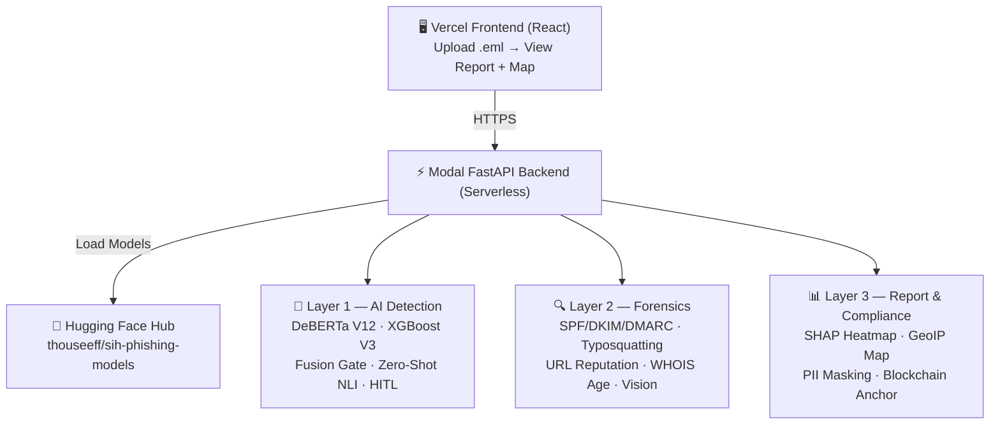

<div align="center">


# 🛡️ EmailGuard AI
### AI-Powered Email Threat Detection, GeoLocation & Forensic Intelligence Platform

**[🚀 Live Demo](https://emailguard-frontend.vercel.app/)** &nbsp;·&nbsp;
**[📦 Models on HF Hub](https://huggingface.co/thouseeff/sih-phishing-models)** &nbsp;·&nbsp;
**[📋 Problem Statement: SIH26106](#-problem-statement)**

</div>

---

## 📌 Problem Statement

> **Organization:** AICTE &nbsp;|&nbsp; **Problem ID:** SIH26106 &nbsp;|&nbsp; **Category:** Software

Email-based threats — phishing, spear-phishing, business email compromise (BEC), and malware delivery — are the **#1 vector for cyberattacks in India**, responsible for over 70% of data breaches annually. Existing spam filters rely on static rules and keyword matching, failing against:

- AI-generated phishing emails with perfect grammar
- Brand impersonation using lookalike domains and logo spoofing
- Multilingual attacks targeting Hindi and regional language users
- QR code phishing (Quishing) bypassing traditional URL scanners
- Calm, professional-tone attacks that evade urgency-based detection

**There is no unified, explainable, forensics-grade platform** that combines deep NLP, structural header analysis, visual intelligence, and legal-grade audit trails into a single system — especially one compliant with **India's DPDP Act 2023** and **BSA / Indian Evidence Act** requirements.

EmailGuard AI solves this.

---

## ✨ What It Does

Upload any `.eml` file. In seconds, the system:

1. **Detects the threat** — hybrid AI ensemble (DeBERTa-v3 + XGBoost) with 93%+ accuracy
2. **Traces the origin** — real attacker IP extracted from SMTP headers, geolocated on a live map
3. **Explains the verdict** — SHAP attention heatmap highlights exactly which words and features triggered the decision
4. **Produces a forensic report** — structured JSON with PII masked, blockchain-anchored for legal admissibility

---

## 🏗️ Architecture




---

## 🧠 AI Pipeline — Deep Dive

### Layer 1 — Threat Detection (Hybrid Ensemble)

| Component | Role | Performance |
|-----------|------|-------------|
| **DeBERTa-v3-large** (LoRA fine-tuned) | Semantic content analysis | 86 / 100 blind benchmark |
| **XGBoost V3** | 42 structural header features | 98.33% accuracy, 99.88% AUC |
| **Fusion Gate (50/50)** | Weighted ensemble + Veto logic | **93 / 100 on real emails** |
| **Zero-Shot NLI** | Intent classification (7 labels) | Urgency / Credential / Deception |
| **HITL Queue** | Uncertainty band 0.40–0.65 | Flagged for human review |

### Layer 2 — Forensics

- **Multi-hop SMTP traversal** — extracts the real originating IP, skipping relay hops
- **SPF / DKIM / DMARC** — full authentication matrix with self-registered domain detection
- **Typosquatting** — Levenshtein ≤ 2 + Unicode / homoglyph normalization vs Indian domain whitelist
- **URL reputation** — unshortening + VirusTotal + Google Safe Browsing
- **WHOIS domain age** — < 30 days = high risk · < 180 days = medium risk
- **Address mismatch** — Reply-To hijack, Return-Path abuse, display name spoofing
- **Vision (OCR + QR + Logo)** — image-embedded text extraction, QR quishing detection, brand spoofing via YOLOv8

### Layer 3 — Report & Compliance

- **SHAP heatmap** — per-word explainability, fully transparent decision reasoning
- **GeoIP map** — attacker country / ISP / ASN on a live interactive map
- **PII masking** — Aadhaar, PAN, phone, email redacted (DPDP Act 2023 compliant)
- **Blockchain anchor** — IPFS off-chain + Polygon Sepolia on-chain SHA-256 hash (BSA / Indian Evidence Act admissible)

---

## 🛠️ Tech Stack

| Layer | Technology |
|-------|------------|
| Frontend | React, Tailwind CSS, Vercel |
| Backend | FastAPI, Modal (serverless GPU) |
| AI Models | DeBERTa-v3-large (HF Hub), XGBoost, SHAP |
| NLP | cross-encoder/nli-deberta-v3-small, EasyOCR |
| Vision | YOLOv8-nano, ZBar / OpenCV, Tesseract |
| GeoIP | ip-api.com, SMTP header traversal |
| Blockchain | Polygon Sepolia testnet, IPFS |
| Model Storage | Hugging Face Hub |
| Secrets | Modal Secrets + .env (local only) |

---

📁 Project Structure
│
├── 📂 sih_backend/
│   ├── 📄 main.py            # FastAPI entrypoint
│   ├── 📄 modal_app.py      # Modal deployment
│   ├── 📄 config.py          # Env-based secrets config
│   │
│   ├── 📂 core/
│   │   └── 📄 orchestrator.py # Master 11-layer pipeline
│   │
│   ├── 📂 eml_parser.py     # .eml parsing
│   │
│   ├── 📂 report_schema.py   # Pydantic response schema
│   │
│   ├── 📂 layers/
│   │   ├── 📄 text_structural/ # DeBERTa + XGBoost + Fusion
│   │   ├── 📄 forensics/       # Auth, WHOIS, URL, Typosquat
│   │   ├── 📄 vision/          # OCR, QR, Logo matching
│   │   ├── 📄 geoip/           # IP geolocation
│   │   └── 📄 nlp_extra/       # Zero-shot NLI, PII masking
│   │
│   └── 📂 explainability/
│       └── 📄 SHAP heatmap
│
├── 📂 sih_frontend/          # React frontend (Vercel)
│
├── 📄 .env.example           # Template — never commit
├── 📄 .gitignore
└── 📄 README.md

---

## 📊 Model Performance

| Model | Metric | Score |
|-------|--------|-------|
| DeBERTa V12 | Blind benchmark (100 real emails) | **86 / 100** |
| XGBoost V3 | Independent holdout (3,897 emails) | **98.33% accuracy** |
| XGBoost V3 | ROC-AUC | **99.88%** |
| Fusion (50/50) | Real .eml batch (100 emails) | **93 / 100** |

---

## 🚀 Running Locally

### Prerequisites
```bash
Python 3.10+
Node.js 18+
```

### Backend
```bash
cd sih_backend
pip install -r requirements.txt
cp .env.example .env        # fill in your API keys
uvicorn main:app --reload
```

### Frontend
```bash
cd sih_frontend
npm install
npm run dev
```

### Deploy to Modal
```bash
modal deploy modal_app.py
```

---

## 🔒 Security & Compliance

| Standard | Implementation |
|----------|----------------|
| **DPDP Act 2023** | NER-based PII masking on all forensic reports |
| **Indian Evidence Act / BSA** | Blockchain-anchored tamper-proof audit logs |
| **HITL Active Learning** | Uncertainty queue for analyst review |
| **Zero Storage Policy** | Emails processed in-memory, never persisted |

---

## 🙋 Try It Live

> No login required. Works on any device.

1. Go to **[emailguard-frontend.vercel.app](https://emailguard-frontend.vercel.app/)**
2. Upload any `.eml` file
3. Get a full forensic threat report in seconds

---

## 👥 Team

Built by **Team Cyber Nova ** · Dayananda Sagar University · Bengaluru
Smart India Hackathon 2026 · Problem ID: **SIH26106** · Category: Cybersecurity

---

## 📄 License

MIT License — free to use, fork, and build on.

---

<div align="center">
  <sub>🛡️ EmailGuard AI · Built for SIH 2026 · Cybersecurity, Privacy & Digital Trust</sub>
</div>
